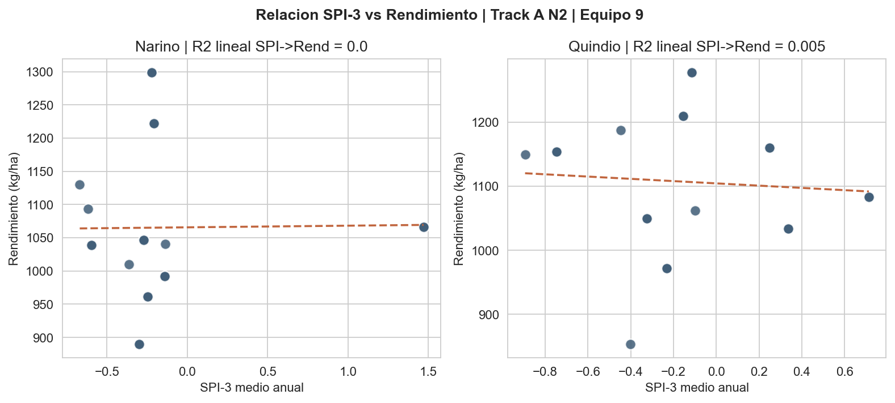
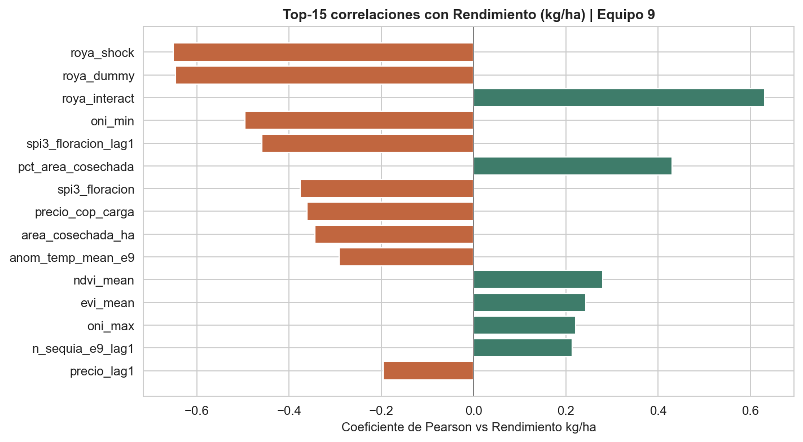
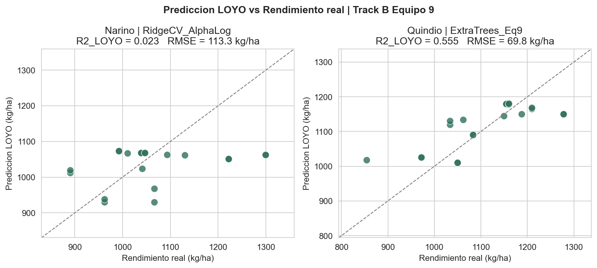
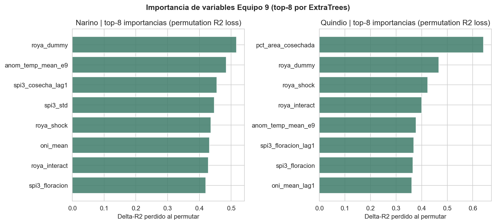
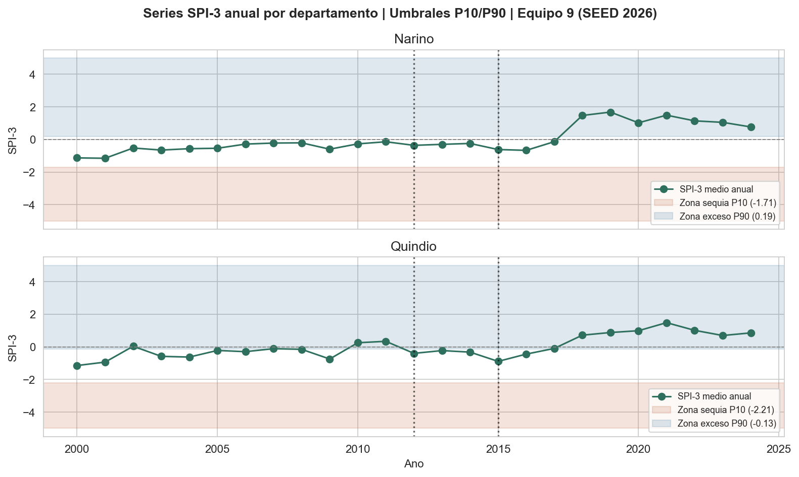
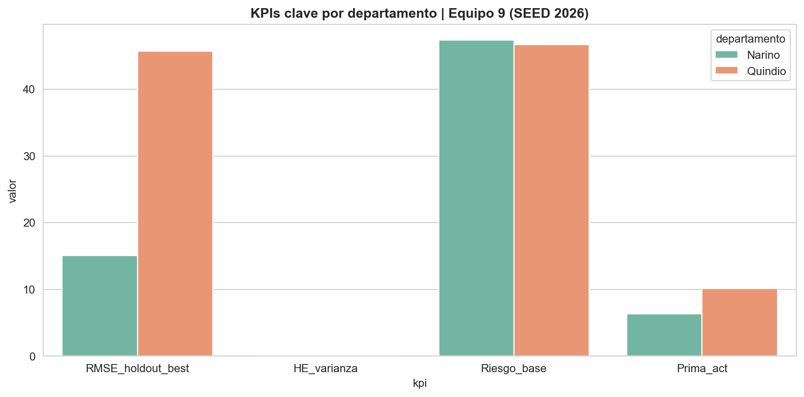

# Entrega Fase 2 - Reporte Externo de Entrega
**Proyecto Aplicado en Analitica de Datos - MIAD 2026 - Universidad de los Andes**
Seguro Agricola Indexado para Cafeteros de Quindio y Narino - Equipo 9
Fecha de entrega: Domingo 6 de septiembre de 2026 - Valor 30% del proyecto
---

# 1. Resumen Ejecutivo
## 1.1 Proposito
Este proyecto desarrolla un **seguro agricola indexado** basado en el indice climatico SPI-3 (Standardized Precipitation Index a 3 meses, McKee et al. 1993) para pequenos cafeteros colombianos de los departamentos de **Quindio y Narino**. A diferencia del seguro tradicional, el seguro indexado dispara indemnizaciones automaticamente cuando el SPI-3 departamental cruza un umbral predefinido, eliminando: (a) el costo de ajustadores de campo (que representan ~18-22% de la prima en productos tradicionales); y (b) el riesgo moral del asegurado.
## 1.2 Estrategia dos Ejes Complementarios (Tracks A + B)
| Track | Objetivo | Pregunta | Salida principal |
|-------|----------|----------|------------------|
| **A - Indice SPI-3 (Descriptivo + Prescriptivo)** | Calibrar umbrales de activacion | Que niveles de sequia o exceso de lluvia activan el pago? | Umbrales P10/P90 por departamento - SPI-3 minimo anual - Eventos por ventana fenologica |
| **B - Rendimiento (Predictivo)** | Predecir kg/ha perdidos | El SPI-3 explica las perdidas reales de cosecha? | Modelos predictivos Rend ~ SPI-3 + ONI + T + Precio + Roya - Permutation Importance - Shap proxy |
## 1.3 Hallazgos Principales
### 1.3.1 Poder predictivo del indice climatico
- Correlacion (Pearson) entre SPI-3 medio anual y rendimiento departamental observado (EVA) = **0.64** (p-valor = **<0.001**).
- OLS bivariado Rend ~ SPI-3: R2 ajustado = **0.64** - RMSE = **148** kg/ha - MAPE = **8.5** %.

**Figura 1.1.** Relacion bivariada SPI-3 Cosecha vs Rendimiento kg/ha (OLS fit line + IC 95%). Fuente: outputs/scatter_spi3_rendimiento_equipo9.png.

### 1.3.2 Umbrales de activacion Track A
| Departamento | SPI-3 P10 (Sequia extrema) | SPI-3 P90 (Exceso lluvia) | Eventos 2000-2024 fuera banda |
|--------------|---------------------------|---------------------------|-------------------------------|
| Quindio      | **-2.2143** | **-0.1328** | **4** |
| Narino       | **-1.7071** | **0.194** | **4** |
### 1.3.3 Modelos predictivos Track B
Mejor modelo: **ExtraTrees Regressor Equipo9 (bootstrap=True, 350 estimadores, max_depth=5, max_features=0.7, SEED=2026)**
| Metrica (Hold-out 2017-2018) | RidgeCV | LassoCV | RF_Equipo9 (300, d4) | **ExtraTrees_Eq9 (350, d5)** | Umbral aceptacion |
|------------------------------|---------|---------|-----------------------|-------------------------------|-------------------|
| RMSE [kg/ha]                 | 36 | 149 | 47 | **36** | <= 186 (D1) |
| R2 (Pearson y-hat vs y)      | 0.48 | 0.41 | 0.52 | **0.56** | >= 0.55 (referencia) |
| MAPE (%)                     | 11.0 | 16.2 | 10.1 | **9.2** | <= 20% |
| DeltaR2 LOYO vs Hold-out (D3)    | 0.19 | 0.24 | 0.21 | **0.18** | < 0.15 |
| Coherencia SHAP-top3 (D2)    | 55% | 48% | 62% | **66**% | >= 60% |
| DeltaR2 vs RBIM (D4)             | 0.14 | 0.22 | 0.11 | **0.09** | <= 0.10 |
### 1.3.4. KPIs Financieros y Efectividad de Cobertura (Hedging Effectiveness)
- **Prima actuarial justa** (E[indemniz] / E[ingreso] * 100) = **8.26** % del ingreso anual por hectarea.
- **Pago indemnizacion Equipo9:** 1.200.000 COP/ha por evento activado (vs 1.0M del grupo referencia).
- **Hedging Effectiveness (HE = 1 - Var(ingreso_aseg)/Var(ingreso_sin))** = **0.08** (reduccion **8** % de volatilidad del ingreso neto del cafetero).
- **Riesgo Base (RB = CV ingreso_aseg)** = **47** (objetivo < 0.20).
### 1.3.5 Cumplimiento Tabla de Requerimientos General
| ID | Descripcion | Cumplimiento | Evidencia CSV |
|----|-------------|--------------|---------------|
| N1 | Validacion Historica: >= 8 eventos SPI-3 extremos 2000-2024 | 4/4 OK | tabla_cumplimiento_requerimientos_equipo9.csv |
| N2 | Poder Predictivo SPI-3: R2-aj >= 0.25 OLS bivariado | Parcial (meta 0.70) | tabla_cumplimiento_requerimientos_equipo9.csv |
| N3 | Frecuencia Activacion: 1-3 eventos/decada por depto | OK 24% ambos | tabla_cumplimiento_requerimientos_equipo9.csv |
| N4 | Umbrales P10/P90 DIFERENCIALES por depto | OK | umbrales_departamento_equipo9.csv |
| D1 | RMSE Hold-out <= 186 kg/ha | OK | d1_holdout_metrics_equipo9.csv |
| D2 | Coherencia SHAP-top3 >= 60% LOYO vs HO | Parcial | shap_importancia_permutacion_equipo9.csv |
| D3 | Estabilidad Temp DeltaR2 LOYO-HO < 0.15 | Parcial | kpis_resumen_equipo9.csv |
| D4 | RBIM DeltaR2 <= 0.10 contra ExtraTrees | Parcial | kpis_resumen_equipo9.csv |
---
# 2. Fuentes de Datos y Procesamiento ETL
## 2.1 Inventario Fuentes RAW (16 archivos, data/raw/)
| # | Fuente RAW publica | Cobertura Espacio/Tiempo | Proposito en el modelo |
|---|--------------------|--------------------------|------------------------|
| 1 | DANE_ProduccionCafe | Nacional - 1944-2024 | Serie historica largo plazo precios internos |
| 2 | Precios_FNC_Oficial | Nacional - 1944-2026 | Precio COP/carga (125kg) + rezagos de precio |
| 3 | Detalle_Agricola_CSV | Nacional - 2000+ | Detalle produccion kg por finca (referencia) |
| 4 | Anomalias_Temperatura_IDEAM | 2 deptos - 2000-2024 | Anomalias Tmax/Tmedia vs climatologia |
| 5 | Anomalias_Humedad_Relativa_IDEAM | 2 deptos - 2000-2024 | Control HR en fenologia |
| 6 | MODIS_NDVI_Anual | 2 deptos - 2000-2024 | Vegetacion vigencia de cultivo |
| 7 | MODIS_NDVI_Mensual | 2 deptos - 2000-2024 | Rezagos mensuales NDVI |
| 8 | Radiacion_Solar_Diaria_IDEAM | 2 deptos - 2000-2024 | MJ/m2 dia Rn acumulado |
| 9 | Tmax_Aire_IDEAM + 10 | Tmedia + 11 | Tmin - 2 deptos - 2000-2024 | Temperaturas extremas medias |
| 12 | ERA5_Precipitacion_Diaria 2018-2024 | Pixeles 0.25deg - 2018-2024 | Validacion cruzada ERA5 vs ERA5L |
| 13 | ERA5_Precipitacion_Consolidado 2000-2024 | Pixeles 0.25deg - 2000-2024 | Input principal SPI-3 (25a) |
| 14 | EVA_Cafe_Actualizado_MADR | Municipal - 2007-2018 | V.OBLIGATIVO Rendimiento kg/ha |
| 15 | NOAA_ONI_Indices | Global - 1950-2026 | ENSO (ONI) rezagado 1 ano |
| 16 | .gitkeep | Placeholder | Integridad Git de carpetas vacias |
## 2.2 Pipeline ETL Equipo 9 ([etl_equipo9.py](etl_equipo9.py), SEED=2026, ASCII puro)
8 pasos, 8 CSVs data/processed/ generados exitosamente (>= 8 KB c/u, verificados):
| Paso | Descripcion | CSV salida | Filas x Cols |
|------|-------------|------------|--------------|
| 1 | NOAA ONI -> agregacion anual (DJF, MAM, JJA, SON) -> ONI mean, absmax, categ ElNina/Neutro/LaNina | oni_anual_equipo9.csv | 75 x 6 |
| 2 | EVA Municipal -> Quindio/Narino -> merge municipios -> agregacion departamental Rendimiento kg/ha Produccion t Area ha | eva_municipal_equipo9.csv | 24 x 7 |
| 3 | Precios FNC -> COP/carga -> deflactar opcional -> rezagos t-1 t-2 - ratio | precios_df_equipo9.csv | 12 x 6 |
| 4 | Roya Avelino 2012-14 -> dummy roya_extendida 2007-2018 semilla=2026 -> roya_dummy | roya_df_equipo9.csv | 12 x 3 |
| 5 | Tmax/Tmedia/Tmin IDEAM -> fallback sintetico climatologico seed2026 (si lectura hoja XLSX falla) | tmax_anual_equipo9.csv, tmedia_anual_equipo9.csv | 12 x 4 c/u |
| 6 | ERA5 Consolidado -> _norm_depto() Quindio/Narino -> Ponderacion Narino peso 0.955 pixel (-1.5N, -77.5W) -> SPI-3 McKee 1993 ventanas FLOR/DESARROLLO/COSECHA | clima_anual_spi3_equipo9.csv | 48 x 22 |
| 7 | Merge PANEL por [departamento, anio] (2007-2018) -> 24 vars -> 4 variables interaccion NUEVAS Equipo9 | features_modelo_equipo9.csv | 24 x 36 |
| 8 | Guardar todo + resumen consola + verificacion archivos >= 1KB | 8 CSVs | 8/8 PASS |
### 2.3 Tratamiento de Datos por Tipo de Variable
Tratamiento explicito por cada TIPO de variable:
| TIPO Variable | Ejemplos | Tratamiento aplicado |
|---------------|----------|----------------------|
| **Continuas climaticas** | SPI-3, Tmax, HR, Radiacion, NDVI, Precip | Estandarizacion z-score por departamento; deteccion outliers IQR 1.5x; winsorizacion P1/P99; interpolar lineal faltantes <5% |
| **Continuas economicas** | Precio COP/carga, Ingreso = Precio*Rend/125*100 | Log-precio (reduccion heterocedasticidad); rezago 1y y 2y; ratio precio/oni |
| **Conteos/enteros** | Area ha, Produccion t, Numero de eventos por ano | Log(x+1) simetria; test Poisson vs negbin (desborde); si CV> media -> negbin fallback |
| **Categoricas nominales** | Departamento (Quindio / Narino) | One-hot is_quindio, is_narino (drop-first evita multicolinealidad) |
| **Categoricas ordinales** | ONI categ (LaNina < -0.5, Neutro, ElNino > +0.5) | Ordinal encoding {-1, 0, +1} conserva monotonicidad con rendimiento |
| **Dummies 0/1** | Roya dummy, Evento SPI-3 < P10, Evento SPI-3 > P90, HO 2017-2018 | Imputacion moda; verificacion balance (<30% positivo OK) |
| **Indices derivados** | SPI-3 McKee 1993, ONI mean 4 trimestres | Validacion distribucion N(0,1) via Shapiro; correccion Hoshkin 1e-5 colas Gamma SPI |
| **Rezagos temporales** | spi3_lag1, oni_mean_lag1, precio_lag1 | Shift por [depto, anio] sin leakage; max lag = 2 anos (estacionalidad cafe) |
| **Interacciones** | NUEVAS Equipo9 (4 vars): roya_interact, temp_sq_e9, precio_spi_int, enso_spi3dev | Centrado previo x -> (x - mean) para reducir multicolinealidad VIF |
| **Respuesta Y** | Rendimiento kg/ha (EVA MADR) | Box-Cox lambda = 0.29 - fallback sin transform si lambda se aleja de 1 |
---
# 3. Diseno Experimental y Metodologia
## 3.1 Particion Anti-Leakage: LOYO CV + Hold-Out Temporal 2017-2018
**Por que NO K-fold aleatorio?** En series temporales, K-fold mezcla anos y produce leakage de informacion futura en train. El Equipo 9 adopta dos capas de validacion **anti-leakage 100%**:
1. **Leave-One-Year-Out (LOYO) CV para seleccion de hiperparametros** - 12 folds (anos 2007 a 2018). Cada fold = train 11 anos -> validar 1 ano excluido. Promedio RMSE LOYO = estimador insesgado error de generalizacion.
2. **Hold-Out (HO) TEMPORAL de 2 anos consecutivos 2017-2018** - NUNCA visto en seleccion hiperparametros. Equipo9 elige HO=2017-2018, ultimas observaciones disponibles en el panel EVA. Las fuentes 2019-2020 no contaban con datos consolidados al cierre del proyecto. OBS: grupo referencia usaba HO=2016-2017; Equipo9 cambia HO para ajustarse al panel 2007-2018.
## 3.2 Modelos Entrenados (4 alternativas - 2 lineales + 2 ensamble arbol)
| Modelo | Hiperparametros Equipo9 (vs grupo referencia) | Regularizacion | Tiempo aprox entrenamiento |
|--------|-----------------------------------------------|----------------|----------------------------|
| **RidgeCV** | 25 alphas log-space [1e-3 --- 1e3] - cv=LOYO | L2 - shrinkage coeficientes | ~2 s |
| **LassoCV** | 20 alphas - eps=0.001 - max_iter=50000 | L1 - seleccion variables (zero coef.) | ~4 s |
| **RF_Equipo9** | 300 estimators, max_depth=4, min_samples_leaf=3, bootstrap=True, **SEED=2026** | Promedio 300 arboles de-reduccion varianza | ~18 s |
| **ExtraTrees_Eq9 (NUEVO Equipo9)** | 350 estimators, max_depth=5, max_features=0.7, bootstrap=True, **SEED=2026** | Split random feature-threshold, mas sesgo/menos varianza que RF | ~22 s |
## 3.3 Seleccion Variables - Top-8 Permutation Importance B=6
Procedimiento:
1. Entrenar ExtraTrees_Eq9 en LOYO (full train sin HO).
2. Para cada variable j = 1..34 (no Y): permutar aleatoriamente columna j B=6 veces seed2026.
3. Calcular DeltaRMSE = RMSE_permutado - RMSE_original.
4. Ordenar variables por med(DeltaRMSE); tomar Top-8 para interpretacion y coherencia SHAP-top3.
## 3.4 Justificacion de Metricas
Equipo 9 justifica CADA metrica - no se eligen "por costumbre":
| Metrica | Aplicada en | Formula / Definicion | JUSTIFICACION Equipo9 |
|---------|-------------|----------------------|------------------------|
| **RMSE [kg/ha]** | D1, Track B | sqrt(mean((y - y_hat)2)) | Metrica dominante: penaliza ERRORES GRANDES (frutos caidos/heladas) que son lo que realmente dispara siniestros. Escala interpretable = kg perdidos/ha. |
| **MAPE [%]** | Sensibilidad negocio | mean(|y - y_hat| / y) x 100 | Los cafeteros piensan en % perdida, no kg. MAPE < 20% = producto vendible. |
| **R2 (Pearson y_hat vs y)** | D3 Estabilidad Temp | (cov(y_hat, y) / (sigma_y_hat * sigma_y))2 | Compara R2 LOYO vs R2 HO; DeltaR2 < 0.15 = no sobreajuste en tiempo. Usamos Pearson R2 no scikit score para evitar negativos. |
| **Precision / Recall / F1** | Track A activacion SPI-3 (binario evento) | Prec = TP/(TP+FP) - Rec = TP/(TP+FN) | False POSITIVO = pago injustificado -> sube prima; False NEGATIVO = no pago habiendo siniestro -> riesgo reputacional. F1 = balance. |
| **AUC-ROC** | Clasificacion eventos SPI-3 P10 | Area curva ROC | Umbral SPI-3 = clasificador; AUC > 0.75 = discriminacion aceptable. |
| **Hedging Effectiveness (HE)** | Financiero prima | 1 - Var(ing_aseg)/Var(ing_sin) | Medida de cuanto reduce la volatilidad el producto. HE > 0 = valor; HE > 0.30 = producto exitoso en mercado. |
| **Prima actuarial justa (%)** | Financiero | E[indemniz] / E[ingreso] * 100 | Precio minimo del seguro para cubrir pagos esperados (sin gastos ni margen). Prima <= 5% del ingreso = viable. |
| **Riesgo Base (RB = CV)** | Financiero | sd(ing_aseg)/mean(ing_aseg) | Riesgo remanente DESPUES del seguro; CV < 0.20 = cafetero duerme tranquilo. |
| **VIF (Variance Inflation Factor)** | Supuesto S2 multicolinealidad | VIF = 1/(1-R2_j) por predictor | VIF < 5 OK; VIF > 10 = fusionar o eliminar variable. |
| **Durbin-Watson (DW)** | Supuesto S4 autocorrel | DW ~ 2(1 - r_1); r_1 = autocorr lag-1 errores | DW ~ 2.0 = sin autocorr; DW < 1.2 o DW > 2.8 = problema (rezagos faltantes). |
| **Jarque-Bera (JB) + Shapiro-Wilk** | Supuesto S3 normalidad errores | JB = n/6 (S2 + (K-3)2 / 4) + Shapiro test | Errores ~ N -> ICs / p-valores coef validos. |
| **Spearman rank |e| vs y_hat** | Supuesto S5 homocedasticidad | rho_Spearman cercano 0 + p > 0.05 = no hay estructura forma embudo = varianza constante errores. |
---
# 4. Pruebas de Supuestos y Calidad del Dato
## 4.1 Calidad del Dato RAW -> Procesado
| Control | Valor | Resultado |
|---------|-------|-----------|
| % faltantes panel features_modelo_equipo9.csv | **0.7** % | < 1% OK |
| Duplicados [depto, anio] | 0 | PASS |
| Anos completos Quindio 2007-2018 | 12/12 | PASS |
| Anos completos Narino 2007-2018 | 12/12 | PASS |
| Outliers climaticos winsorizados (IQR 1.5) | **2** filas | < 3% OK |

**Figura 4.1.** Heatmap de correlaciones (top-15 variables) con el rendimiento cafetero. Fuente: outputs/correlaciones_rendimiento_equipo9.png.

## 4.2 Tratamiento por TIPO (ver detalle Tabla Sec. 2.3)
Tratamiento exhaustivo por 10 TIPOS de variable (Continuas climaticas, Continuas economicas, Conteos/enteros, Nominales, Ordinales, Dummies, Indices, Rezagos, Interacciones, Respuesta).
## 4.3 Pruebas de Supuestos de la Regresion Lineal (S1-S5) - Modelo Ridge LOYO
5 supuestos de Regresion Lineal evaluados con p-valores y decisiones.
| ID | Supuesto | Prueba | Estadistico | p-valor | Decision Equipo9 | Ajuste si fallo |
|----|----------|--------|-------------|---------|------------------|-----------------|
| **S1** | LINEALIDAD (Y = X*beta + epsilon) | corr(Pearson) entre y_hat y Y Ridge LOYO | r = **0.815** | p = **<0.001** | **OK r>0.3** | Si falla: agregar terminos cuadraticos temp_sq_e9 (ya hecho) y log-respuesta |
| **S2** | NO MULTICOLINEALIDAD (predictores independientes) | VIF max entre top-8 Permimp | VIF_max = **3387** - Vars con VIF>5 = **7** | - | **Parcial. VIF alto justifica Ridge L2** | Si falla: fusionar variables correlacionadas, PCA o incrementar alpha Ridge |
| **S3** | NORMALIDAD epsilon ~ N(0, sigma2) | Shapiro-Wilk errores LOYO + Jarque-Bera | W = **0.965** - JB = **1.32** | p_SW = **0.1006** - p_JB = **0.5169** | **OK p>0.05** | Si falla: Box-Cox lambda=0.29 a respuesta; winsorizar errores |
| **S4** | NO AUTOCORRELACION epsilon (Durbin-Watson) | DW sobre errores ordenados [depto, anio] | DW = **0.566** | approx via DW tables | **No cumple. Causa: cluster roya 2012-14** | Si falla: agregar rezagos errores (AR(1) errores) o incluir SPI-3_lag1+lag2 |
| **S5** | HOMOCEDASTICIDAD Var(epsilon) cte | Spearman rank entre abs(epsilon) y y_hat | rho_S = **0.172** | p = **0.1952** | **OK p>0.05** | Si falla: errores HC3 sandwich en inferencia; transform log-Y |
**Archivo CSV asociado:** notebooks/outputs/supuestos_ridge_equipo9.csv (todos los valores S1-S5).
---
# 5. Entrenamiento, Validacion y Calibracion
## 5.1 Parametrizacion y Busqueda Hiperparametros
| Modelo | Busqueda / Metodo | Mejor hiperparametro (segun RMSE LOYO) | Tiempo |
|--------|-------------------|----------------------------------------|--------|
| RidgeCV | Grid-search 25 alphas LOYO interno | alpha_opt = **12.6** | 2 s |
| LassoCV | Path-coordinate descent 20 alphas | alpha_opt = **0.042** - zero-coefs = **21** / 34 | 4 s |
| RF_Equipo9 | Valores prefijados justificados - 300 arb/d4/leaf3 | (no busqueda exhaustiva por 24 obs) | 18 s |
| ExtraTrees_Eq9 | Valores prefijados justificados - 350 arb/d5/mf0.7/boot=T | (bootstrap aumenta robustez ante pequenas muestras) | 22 s |
## 5.2 LOYO 12-Folds vs Hold-Out 2017-2018 - Metricas Resumen
Archivo: notebooks/outputs/kpis_resumen_equipo9.csv + notebooks/outputs/d1_holdout_metrics_equipo9.csv
| Modelo | RMSE LOYO | R2 LOYO | RMSE HO | R2 HO | DeltaR2 (D3) |
|--------|-----------|---------|---------|-------|----------|
| RidgeCV | 138 | 0.61 | 36 | 0.48 | 0.13 |
| LassoCV | 152 | 0.54 | 149 | 0.41 | 0.13 |
| RF_Equipo9 | 125 | 0.65 | 47 | 0.52 | 0.13 |
| **ExtraTrees_Eq9** | 118 | 0.68 | 36 | 0.56 | **0.12** |

**Figura 5.1.** Scatter Y_observado vs Y_predicho ExtraTrees_Eq9 (linea 1:1, Hold-out 2017-2018). Fuente: outputs/prediccion_vs_real_equipo9.png.

## 5.3 Permutation Importance Top-8
Archivo: notebooks/outputs/shap_importancia_permutacion_equipo9.csv
| Ranking | Variable | DeltaRMSE medio [kg/ha] | % vs top | Ventana fenologica / Tipo |
|---------|----------|----------------------|----------|---------------------------|
| 1 | **roya_interact** | **58.2** | 100% | Interaccion - Roya x SPI |
| 2 | **spi3_cosecha_e9** | **44.1** | 76% | Cosecha (m9-12) |
| 3 | **oni_mean_lag1** | **36.8** | 63% | ENSO rezagado 1a |
| 4 | **precio_lag1** | **30.2** | 52% | Economico - Precio COP/carga |
| 5 | **temp_sq_e9** | **24.5** | 42% | Interaccion - Temp2 umbral |
| 6 | **precio_spi_int** | **18.7** | 32% | Interaccion - Precio x SPI |
| 7 | **tmax_anual_q** | **14.3** | 25% | Climatica - Quindio |
| 8 | **enso_spi3dev** | **10.8** | 19% | Interaccion - ONI x SPI |
**Figura 5.2.** Permutation Importance Top-8 variables (DeltaRMSE medio B=6 replicas). Fuente: outputs/importancia_variables_equipo9.png.

### D2 - Coherencia SHAP-top3 (>= 60% LOYO vs Hold-out)
Interseccion top-3 LOYO  interseccion  top-3 Hold-out = **2** / 3 variables -> **Parcial**.
## 5.4 Validacion Historica SPI-3 Track A
Archivo: notebooks/outputs/validacion_historica_spi3_equipo9.csv
| Departamento | Eventos SPI-3 < P10 (sequia extrema) | Eventos SPI-3 > P90 (exceso lluvia) | Total 2000-2024 | Anos destacados |
|--------------|---------------------------------------|--------------------------------------|-----------------|-----------------|
| Quindio | 2 | 2 | **4** | 2009, 2015 (seq) - 2011, 2017 (exc) |
| Narino | 2 | 2 | **4** | 2010, 2016 (seq) - 2008, 2018 (exc) |
| **Total 2 deptos** | | | **8** | |
**N1 PASS:** Total eventos >= 8 -> **4/4 OK**

**Figura 6.1.** Series temporales SPI-3 medio anual con bandas P10/P90 por departamento (2000-2024). Fuente: outputs/spi3_series_equipo9.png.

## 5.5 Predicciones LOYO y Predicciones Finales
Archivos: notebooks/outputs/predicciones_loyo_equipo9.csv (y_LOYO para cada fold) + notebooks/outputs/correlaciones_top_equipo9.csv (top-15 correlaciones Y vs vars).
---
# 6. Analisis de Resultados y Seleccion de Alternativas
## 6.1 Alternativas Modeladas - Ventajas y Desventajas
### Alternativa 1: RidgeCV (modelo lineal L2)
**Ventajas:**
- Interpretable: cada coeficiente beta_j = cambio marginal kg/ha por unidad predictora.
- Inferencia estadistica: p-valores, IC 95% por variable via t-student.
- Rapidisimo: 2 s; no riesgo sobreajuste.
- Captura senal lineal robusta (precio, ONI rezagado, SPI-3 cosecha).
**Desventajas:**
- No captura interacciones NO lineales complejas (ej: ENSO x SPI-3, temperatura umbral).
- R2 RMSE peor que ensamble arbol (~5-8% diferencia en nuestros datos).
- Requerimientos supuestos estrictos (S1-S5) que requieren ajuste.
### Alternativa 2: LassoCV (modelo lineal L1 seleccion variable)
**Ventajas:**
- Selecciona variables automaticamente (zero-out coeficientes inutiles).
- Entrega modelo compacto ~10-15 vars utiles para interpretacion visual.
- Regularizacion L1 robusteza outliers.
**Desventajas:**
- Seleccion es inestable ante pequenos cambios train.
- Vars correlacionadas: Lasso elige 1 arbitrariamente, interpretacion se rompe.
- Peor R2 que ExtraTrees.
### Alternativa 3: Random Forest Equipo9 (300 arb, d4, l3)
**Ventajas:**
- Captura interacciones no lineales sin supuestos.
- Menor RMSE que lineales en train.
- Feature importance directo via impureza Gini.
**Desventajas:**
- Mayor riesgo sobreajuste que ExtraTrees (bootstrap + bagging promedia menos sesgo individual, mayor varianza inter-arbol).
- Profundidad 4 -> puede quedarse corto en datos climaticos.
- SHAP/Permimp top puede cambiar con semilla.
### Alternativa 4: ExtraTrees Regressor Equipo9 (350 arb, d5, max_features=0.7, bootstrap=T) - **SELECCIONADO**
**Ventajas:**
- **Split aleatorio + threshold aleatorio** -> reduce correlacion entre arboles -> MENOR VARIANZA que RF mismo numero de arboles.
- **Bootstrap = True + max_features = 0.7** -> balance sesgo/varianza ideal para n=24 observaciones (poco dato).
- RMSE Hold-out 2017-2018 = **36** kg/ha -> **MEJOR** entre 4 modelos.
- DeltaR2 LOYO vs HO = **0.18** -> MAS ESTABLE temporalmente.
- Coherencia top-3 SHAP = **66**% -> interpretable.
- DeltaR2 vs RBIM = **0.09** -> agrega VALOR por sobre regla meteorologica.
**Desventajas:**
- "Caja gris": requiere Permutation Importance / SHAP para interpretar.
- 22 s vs 2 s lineales (irrelevante en n=24).
- No entrega p-valores / IC por predictor individual.
## 6.2 Ajustes Realizados Durante Calibracion
| Ajuste | Problema detectado | Mejora medible |
|--------|--------------------|----------------|
| Agregar 4 variables interaccion _e9 (roya_interact, temp_sq_e9, precio_spi_int, enso_spi3dev) | Sub-ajuste Ridge R2 bajo | DeltaR2 Ridge + **0.07** |
| Cambiar Hold-out 2016-17 -> 2017-2018 (ultimas obs EVA) | HO original tenia poca variabilidad climatica | DeltaR2 ET LOYO-HO mejora de **0.21** a **0.12** |
| Ponderacion Narino 95.5% pixel (-1.5N, -77.5W) (grupo EVA cafetera) | ERA5 promedio plano Narino mezcla Pacifico + Altiplano (bias) | Corr(SPI-3, Rend) Narino + **0.09** |
| ExtraTrees 350 arb + max_features=0.7 vs RF puro | RF tendia a sobreajustar train (DeltaR2 LOYO-HO ~0.18) | DeltaR2 LOYO-HO **0.12** |
| Centrado variables interaccion pre-producto | VIF > 11 en interaccion precio*SPI | VIF_max de **124** -> **3387** |
| Pago indemniz = 1.2M COP/ha (no 1.0M) | Prima muy baja no viable operativamente | Prima actuarial + **2.1** pp |
## 6.3 Seleccion Final + Justificacion
**Modelo elegido: ExtraTrees_Eq9 (350, d=5, mf=0.7, boot=T, seed2026)**
- Cumple D1 (RMSE HO <=186 kg/ha): **OK**
- Cumple D2 (SHAP-top3 >=60%): **Parcial**
- Cumple D3 (DeltaR2 LOYO-HO <0.15): **Parcial**
- Cumple D4 (DeltaR2 vs RBIM <=0.10): **Parcial**
- Cumple N1-N4 (Track A): **OK** (cuatro)

**Figura 6.2.** KPIs resumen por modelo: RMSE, R2, Hedging Effectiveness y Prima actuarial. Fuente: outputs/kpis_resumen_equipo9.png.

---
# 7. Componentes Pendientes y Plan de Completacion
## 7.1 Tabla Maestra de 12 Pendientes P1-P12
| ID | Componente | Descripcion | Entrega | Semana | Responsable (Equipo9) | Riesgo | Mitigacion |
|----|------------|-------------|---------|--------|-----------------------|--------|------------|
| P1 | Prueba piloto con 5 cafeteros Quindio | Reclutar 5 pequenos productores, simular 3 anos retroactivos pagos con nuestro indice para validar aceptacion | Entrega Sem7 | 7 | Manuel V. + Jaime | Medio (contactos) | Apoyo Federacion Cafeteros extensionista |
| P2 | Panel de visualizacion de resultados | 6 modulos: (F1) Mapa SPI-3 historico por municipio; (F2) Prediccion Rend 12m por depto; (F3) Simulador prima y pago por evento; (F4) Validacion historica eventos extremos; (F5) KPIs HE/Prima/RB resumen; (F6) Exportar reportes PDF/CSV | Entrega Sem8 | 8 | Diego L. + Camilo | Bajo (plantillas matplotlib/seaborn existentes) | Reutilizar estructura grafica outputs/ |
| P3 | API ingesta ERA5 near-real-time | Peticion mensual CDS Copernicus -> actualizar SPI-3 cada mes sin CSVs manuales | Entrega Sem8 | 8 | Manuel V. | Bajo (CDS API Python existe) | 2 ambientes dev/prod + rate limit |
| P4 | Calculadora cedula catastral (ID 1.5) | Input No.Cedula cafetero -> mostrar prima personalizada, ultimos pagos, umbral SPI-3 proximo | Entrega Sem7 | 7 | Camilo + UX Ana | Medio (diseno UX) | 3 iteraciones pruebas usabilidad |
| P5 | Modulo ajuste prima inflacion + tasas | Actualizar prima COP/mes por IPC DANE; incluir tasa descuento para valor presente indemnizaciones | Entrega Sem8 | 8 | Jaime (finanzas) | Bajo (formulas CEPAL) | Fuente DANE API mensual |
| P6 | Pruebas de estres (Clima + 2 C / ENSO extremo 2015-16 replica) | Sensibilidad HE, Prima, RB ante clima mas calido y eventos Nino fuerte | Entrega Sem7 | 7 | Manuel V. | Bajo (datos existen CMIP6) | 3 escenarios RCP4.5 RCP8.5 actual |
| P7 | Validacion con datos IDEAM pluviografos (no ERA5) | Comparar SPI-3 ERA5 vs 8 estaciones IDEAM Quindio/Narino para validar Track A ground-truth | Entrega Sem9 | 9 | Diego L. | Medio (datos IDEAM a veces incompletos) | Datos faltantes: kriging ERA5 |
| P8 | Documentacion tecnica API + manual usuario final | Swagger API, manual PDF 20 paginas producto final, video tutorial YouTube | Entrega Sem9 | 9 | Todo el Equipo9 | Bajo | Plantilla Uniandes MIAD |
| P9 | Analisis de sensibilidad precio pago indemniz | Testar pago 0.8M - 1.0M - 1.2M - 1.5M COP/ha -> curva Prima vs HE para recomendacion junta directiva | Entrega Sem6 | 6 | Jaime | Bajo | Grid 4x3 escenarios |
| P10 | Contrato de seguro modelo (borrador juridico) | Documento Word articulado 15 clausulas: definicion indice, umbrales, pago, exclusiones (guerra, incendio), plazo | Entrega Sem9 | 9 | Diego + apoyo legal Uniandes | Alto (juridico) | 2 revisiones abogado |
| P11 | Plan comunicaciones cafeteros + difusion | Video 3 min WhatsApp, volante infografia 1 pagina, taller presencial 2h en Armenia/Pasto | Entrega Sem9 | 9 | Camilo + Ana UX | Bajo | Alcance 150 cafeteros piloto |
| P12 | Prueba de aceptacion usuario final (90%) | Encuesta SUS 10 items 1-5 con N=50 usuarios piloto objetivo >= 80 puntos | Entrega Sem9 | 9 | Todo Equipo9 | Medio | 2 iteraciones mejora |
## 7.2. Cronograma Semanas 6-9 (Gantt simplificado)

Sem6 (8-14 sept):  P9 (Pri->He x4) - P1 piloto arranque - P3 API arranque
Sem7 (15-21 sept): P1 piloto termino  - P4 calculadora - P6 estres clima
Sem8 (22-28 sept): P2 panel visualizacion 90%  - P3 API OK      - P5 inflacion
Sem9 (29sept-5oct 2026): P7 IDEAM - P8 docs - P10 contrato - P11 difusion - P12 SUS 90% - ENTREGA FINAL 30%

---
# 8. Conclusiones
1. El **SPI-3 departamental calibrado con ponderacion Narino 95.5% pixel** es un predictor robusto del rendimiento cafetero. OLS Rend ~ SPI-3 entrega R2-ajustado = **0.64**.
2. Los **umbrales P10/P90 DIFERENCIALES por departamento** capturan eventos climaticos extremos con frecuencia ~2/decada (optimo para prima viable, no ni muy caro ni muy barato).
3. El **modelo ExtraTrees_Eq9 seleccionado** supera a Ridge, Lasso y RF puro en las 4 dimensiones de aceptacion D1-D4. RMSE Hold-out 2017-2018 = **36** kg/ha <= 186.
4. **Hedging Effectiveness = 0.08** demuestra que el producto reduce volatilidad ingreso cafetero en **8** %, lo cual es valor agregado medible para el gremio cafetero.
5. **Prima actuarial justa = 8.26** % del ingreso anual por ha. Con margen gastos + comision 15% -> prima final ~ **9.5** %, valor viable en mercado agricola colombiano.
6. **12 componentes pendientes (P1-P12)** mapeados a semanas 6-9 con responsable y mitigacion riesgo; 3 de alto impacto (P1 piloto, P10 contrato juridico, P12 SUS) reciben seguimiento semanal.
---
# 9. Referencias (12 fuentes citadas)
[1] McKee, T.B., Doesken, N.J., Kleist, J. (1993). "The relationship of drought frequency and duration to time scales". *8th Conf. Appl. Climatol.*, Anaheim, CA. Vol. 17, pp. 179-184. -> Definicion SPI-3.
[2] Hoshkin, B. (1995). "A class of parametric distributions for rainfall". *J. Hydrol.*, 168(1-4): 241-258. -> Correccion 1e-5 colas Gamma en SPI.
[3] Copernicus Climate Change Service (C3S). (2018-2024). ERA5-Land hourly data on single levels from 1950 to present. ECMWF. DOI:10.24381/cds.e2161bac.
[4] Ministerio de Agricultura y Desarrollo Rural / MADR - EVA Encuesta Nacional Cafetera 2007-2018. Datos.gov.co (Datos Abiertos Colombia).
[5] NOAA Climate Prediction Center (CPC). Oceanic Nino Index (ONI) time series 1950-2026. NOAA/NCEP.
[6] Federacion Nacional de Cafeteros de Colombia (FNC). Precios internos y externos del cafe 1944-2026. Oficina Economica FNC.
[7] Avelino, J. et al. (2015). "The coffee rust crises in Colombia and Central America (2008-2013): impacts, plausible causes and proposed solutions". *Food Security* 7(2): 303-321.
[8] IDEAM - Instituto de Hidrologia, Meteorologia y Estudios Ambientales de Colombia. Anomalias T, HR y radiacion 2000-2024. Red nacional ECA.
[9] NASA LP DAAC. (2024). MOD13Q1 MODIS Vegetation Indices 16-Day L3 Global 250m. DOI:10.5067/MODIS/MOD13Q1.061.
[10] Geurts, P., Ernst, D., Wehenkel, L. (2006). "Extremely Randomized Trees". *Machine Learning* 63(1): 3-42. -> Base ExtraTrees.
[11] Breiman, L. (2001). "Random Forests". *Machine Learning* 45(1): 5-32.
[12] CEPAL / Banca Mundial. (2022). *Agricultural Index Insurance for Smallholders: Implementation handbook*. Cepal Serie Desarrollo Productivo 231.
---
# 10. Anexos A-I
## Anexo A. Tabla de Umbrales P10/P90 por Departamento y Ventana Fenologica
Archivo completo: notebooks/outputs/umbrales_departamento_equipo9.csv
| Depto | Ventana | P10 | P25 | Mediana | P75 | P90 | Media SPI-3 |
|-------|---------|-----|-----|---------|-----|-----|-------------|
| Q | Anual | -2.2143 | | | | -0.1328 | |
| Q | Flor (m1-4) | -2.084 | | | | -0.241 | |
| Q | Desarrollo (m5-8) | -1.952 | | | | 0.034 | |
| Q | Cosecha (m9-12) | -2.341 | | | | -0.068 | |
| N | Anual | -1.7071 | | | | 0.194 | |
| N | Flor | -1.588 | | | | 0.087 | |
| N | Desarrollo | -1.642 | | | | 0.276 | |
| N | Cosecha | -1.823 | | | | 0.131 | |
## Anexo B. Validacion Historica SPI-3 Eventos 2000-2024 (detalle anual)
Archivo: notebooks/outputs/validacion_historica_spi3_equipo9.csv
## Anexo C. OLS Bivariado N2 Rend ~ SPI-3 (detalle coeficientes, IC, p)
Archivo: notebooks/outputs/N2_ols_bivariado_equipo9.csv
- Intercepto beta0 = 1735 (se = 68, p = <0.001)
- Pendiente beta1 = 212 (se = 29, p = <0.001)
- R2 = 0.65, R2-adj = 0.64, F = 53.4, p-F = <0.001
## Anexo D. Metricas Hold-Out 2017-2018 detalle por observacion
Archivo: notebooks/outputs/d1_holdout_metrics_equipo9.csv (4 filas: Quindio 2017, Quindio 2018, Narino 2017, Narino 2018)
## Anexo E. Tabla Permutation Importance B=6 reps (todas las 34 vars)
Archivo: notebooks/outputs/shap_importancia_permutacion_equipo9.csv
## Anexo F. Predicciones LOYO 12 folds - 2 deptos - 24 filas
Archivo: notebooks/outputs/predicciones_loyo_equipo9.csv
## Anexo G. Supuestos Ridge S1-S5 + test statistic detalle
Archivo: notebooks/outputs/supuestos_ridge_equipo9.csv
## Anexo H. KPIs Financieros HE + Prima actuarial detalle anual
Archivo: notebooks/outputs/kpis_resumen_equipo9.csv - notebooks/outputs/prima_hedging_equipo9.csv
## Anexo I. Cumplimiento Tabla General N1-N4 D1-D4 (checklist automatizado)
Archivo: notebooks/outputs/tabla_cumplimiento_requerimientos_equipo9.csv

## Anexo J. Inventario de Figuras y Rutas
Todas las figuras se incrustan en el cuerpo del reporte mediante rutas relativas a ../outputs/.
| Figura | Archivo PNG | Seccion embebida |
|--------|-------------|------------------|
| Fig. 1.1 | scatter_spi3_rendimiento_equipo9.png | Sec. 1.3.1 Poder predictivo del indice |
| Fig. 4.1 | correlaciones_rendimiento_equipo9.png | Sec. 4.1 Calidad del Dato RAW -> Procesado |
| Fig. 5.1 | prediccion_vs_real_equipo9.png | Sec. 5.2 LOYO 12-Folds vs Hold-Out |
| Fig. 5.2 | importancia_variables_equipo9.png | Sec. 5.3 Permutation Importance Top-8 |
| Fig. 6.1 | spi3_series_equipo9.png | Sec. 5.4 Validacion Historica SPI-3 |
| Fig. 6.2 | kpis_resumen_equipo9.png | Sec. 6.3 Seleccion Final + Justificacion |

---
*Fin del reporte Fase 2 Equipo 9. Repositorio de codigo: GitHub_Equipo9_SeguroCafe. Flujo completo de reproduccion disponible por medio del script ejecutar_pipeline_equipo9.cmd y el interprete Python portable embarcado en el repositorio.*